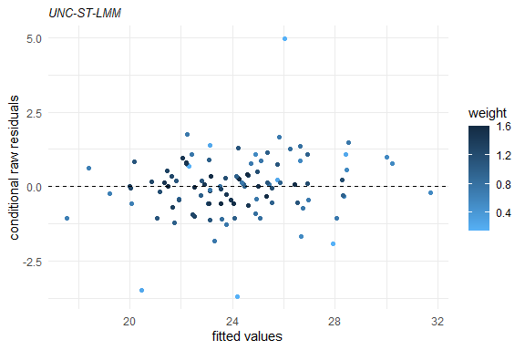
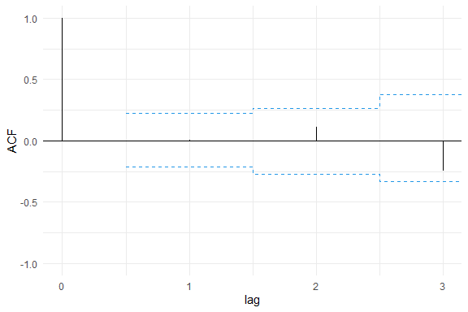
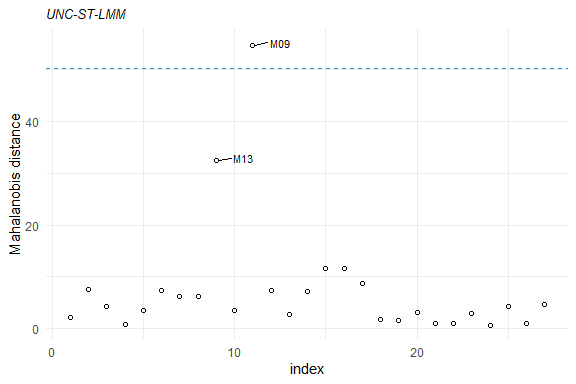
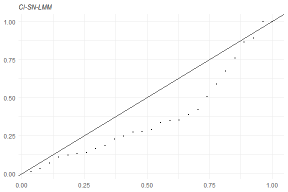

<!--  README.md is generated from README.Rmd. Please edit that file -->

# skewlmm

[](https://cran.r-project.org/package=skewlmm)

The goal of skewlmm is to fit skew robust linear mixed models, using
scale mixture of skew-normal linear mixed models with possible
within-subject dependence structure, using an EM-type algorithm. In
addition, some tools for model adequacy evaluation are available.

For more information about the model formulation and estimation, please
see Schumacher, F. L., Lachos, V. H., and Matos, L. A. (2021). Scale
mixture of skew‐normal linear mixed models with within‐subject serial
dependence. *Statistics in Medicine*. DOI:
[10.1002/sim.8870](https://doi.org/10.1002/sim.8870).

## Installation

<!-- You can install the released version of lmmsmsn from [CRAN](https://CRAN.R-project.org) with: -->

You can install skewlmm from GitHub with:

``` r
devtools::install_github("fernandalschumacher/skewlmm")
```

Or you can install the released version of skewlmm from
[CRAN](https://CRAN.R-project.org) with:

``` r
install.packages("skewlmm")
```

## Example

This is a basic example which shows you how to fit a SMSN-LMM:

``` r
library(skewlmm)
#> Loading required package: optimParallel
#> Loading required package: parallel
dat1 <- as.data.frame(nlme::Orthodont)
fm1 <- smsn.lmm(dat1, formFixed = distance ~ age, formRandom = ~ age,
                groupVar = "Subject", distr = "st",
                control = lmmControl(quiet = TRUE))
summary(fm1)
#> Linear mixed models with distribution st and dependency structure UNC 
#> Call:
#> smsn.lmm(data = dat1, formFixed = distance ~ age, groupVar = "Subject", 
#>     formRandom = ~age, distr = "st", control = lmmControl(quiet = TRUE))
#> 
#> Distribution st with nu = 4.662322 
#> 
#> Random effects: 
#>   Formula: ~age
#>   Structure:  
#>   Estimated variance (D):
#>             (Intercept)         age
#> (Intercept)   6.5378399 -0.55063265
#> age          -0.5506326  0.07893262
#> 
#> Fixed effects: distance ~ age
#> with approximate confidence intervals
#>                  Value Std.error CI 95% lower CI 95% upper
#> (Intercept) 17.0163263 0.9456852   15.1628173   18.8698353
#> age          0.6248518 0.1242525    0.3813214    0.8683822
#> 
#> Dependency structure: UNC
#>   Estimate(s):
#>  sigma2 
#> 0.81705 
#> 
#> Skewness parameter estimate: -3.000814 2.202111
#> 
#> Model selection criteria:
#>    logLik     AIC     BIC
#>  -209.837 437.675 461.814
#> 
#> Number of observations: 108 
#> Number of groups: 27
plot(fm1)
```



Several methods are available for SMSN and SMN objects, such as:
`print`, `summary`, `plot`, `fitted`, `residuals`, `predict`, and
`update`.

Some tools for goodness-of-fit assessment are also available, for
example:

``` r
acf1<- acfresid(fm1, calcCI = TRUE)
plot(acf1)
```



``` r
plot(mahalDist(fm1), nlabels = 2)
```



``` r
healy.plot(fm1, calcCI = TRUE)
```



Furthermore, to fit a SMN-LMM one can use the following:

``` r
fm2 <- smn.lmm(dat1, formFixed = distance ~ age, formRandom = ~ age,
               groupVar = "Subject", distr = "t",
               control = lmmControl(quiet = TRUE))
summary(fm2)
#> Linear mixed models with distribution t and dependency structure UNC 
#> Call:
#> smn.lmm(data = dat1, formFixed = distance ~ age, groupVar = "Subject", 
#>     formRandom = ~age, distr = "t", control = lmmControl(quiet = TRUE))
#> 
#> Distribution t with nu = 4.966122 
#> 
#> Random effects: 
#>   Formula: ~age
#>   Structure:  
#>   Estimated variance (D):
#>             (Intercept)         age
#> (Intercept)   3.2735098 -0.16423589
#> age          -0.1642359  0.03246643
#> 
#> Fixed effects: distance ~ age
#> with approximate confidence intervals
#>                 Value  Std.error CI 95% lower CI 95% upper
#> (Intercept) 17.274030 0.67741340   15.9463240   18.6017357
#> age          0.593514 0.06218718    0.4716294    0.7153986
#> 
#> Dependency structure: UNC
#>   Estimate(s):
#>    sigma2 
#> 0.8926729 
#> 
#> Model selection criteria:
#>    logLik     AIC     BIC
#>  -211.351 436.701 455.476
#> 
#> Number of observations: 108 
#> Number of groups: 27
```

Now, for performing a LRT for testing if the skewness parameter is 0
($\text{H}_0: \lambda_i=0, \forall i$), one can use the following:

``` r
lr.test(fm1,fm2)
#> 
#> Model selection criteria:
#>       logLik     AIC     BIC
#> fm1 -209.837 437.675 461.814
#> fm2 -211.351 436.701 455.476
#> 
#>     Likelihood-ratio Test
#> 
#> chi-square statistics =  3.026434 
#> df =  2 
#> p-value =  0.2202005 
#> 
#> The null hypothesis that both models represent the 
#> data equally well is not rejected at level  0.05
```

By default, the functions `smsn.lmm` and `smn.lmm` now use the DAAREM
method (a method for EM accelaration, for details see
`help(package="daarem")`) for estimation, to improve the computational
performance. This method usually greatly reduces the convergence time,
but its use can result in numerical errors, specially for small samples.
In this cases, the EM algorithm can be used, as follows:

``` r
fm2EM <- smn.lmm(dat1, formFixed = distance ~ age, formRandom = ~ age, distr = 't',
                 groupVar = "Subject", control = lmmControl(algorithm = "EM", 
                                                            quiet = TRUE))
fm2EM
#> Linear mixed models with distribution t and dependency structure UNC 
#> Call:
#> smn.lmm(data = dat1, formFixed = distance ~ age, groupVar = "Subject", 
#>     formRandom = ~age, distr = "t", control = lmmControl(algorithm = "EM", 
#>         quiet = TRUE))
#> 
#> Fixed: distance ~ age
#> Random:
#>   Formula: ~age
#>   Structure: General positive-definite 
#>   Estimated variance (D):
#>             (Intercept)        age
#> (Intercept)   3.1584628 -0.1533659
#> age          -0.1533659  0.0314773
#> 
#> Estimated parameters:
#>      (Intercept)    age sigma2 Dsqrt11 Dsqrt12 Dsqrt22    nu1
#>          17.2876 0.5958 0.8982  1.7754 -0.0793  0.1587 4.9883
#> s.e.      0.6684 0.0616 0.2460  0.8421  0.0931  0.0518     NA
#> 
#> Model selection criteria:
#>    logLik     AIC     BIC
#>  -211.351 436.701 455.476
#> 
#> Number of observations: 108 
#> Number of groups: 27
```

Also, we can fit a t-LMM with diagonal scale matrix for the random
effects by using:

``` r
fm2diag <- update(fm2, covRandom = "pdDiag")
fm2diag
#> Linear mixed models with distribution t and dependency structure UNC 
#> Call:
#> smn.lmm(data = dat1, formFixed = distance ~ age, groupVar = "Subject", 
#>     formRandom = ~age, distr = "t", covRandom = "pdDiag", control = lmmControl(quiet = TRUE))
#> 
#> Fixed: distance ~ age
#> Random:
#>   Formula: ~age
#>   Structure: Diagonal 
#>   Estimated variance (D):
#>             (Intercept)        age
#> (Intercept)    1.546268 0.00000000
#> age            0.000000 0.01789115
#> 
#> Estimated parameters:
#>      (Intercept)    age sigma2 Dsqrt11 Dsqrt22    nu1
#>          17.2827 0.5959 0.9699  1.2435  0.1338 4.9841
#> s.e.      0.5864 0.0540 0.2388  0.6191  0.0551     NA
#> 
#> Model selection criteria:
#>    logLik     AIC    BIC
#>  -211.598 435.197 451.29
#> 
#> Number of observations: 108 
#> Number of groups: 27
```

We can compare the information criteria for all fitted models using the
`criteria` function, as follows:

``` r
criteria(list(`ST-LMM` = fm1, `t-LMM` = fm2, `t-LMM(EM)` = fm2EM, `t-LMM-diag` = fm2diag))
#>               logLik npar      AIC      BIC
#> ST-LMM     -209.8374    9 437.6748 461.8140
#> t-LMM      -211.3506    7 436.7012 455.4761
#> t-LMM(EM)  -211.3506    7 436.7013 455.4762
#> t-LMM-diag -211.5985    6 435.1969 451.2897
```

For more examples, see `help(smsn.lmm)` and `help(smn.lmm)`.

## Handling censored/missing observations

An extension of the methods to account for censoring in SMSN-LMM is
under development. Tools for accommodating left, right, or interval
censored observations in the symmetrical family SMN-LMM are now
available using the function `smn.clmm`.

For more information on censored models, we refer to Matos, L. A.,
Prates, M. O., Chen, M. H., and Lachos, V. H. (2013). Likelihood-based
inference for mixed-effects models with censored response using the
multivariate-t distribution. *Statistica Sinica*. DOI:
[10.5705/ss.2012.043](http://dx.doi.org/10.5705/ss.2012.043).
