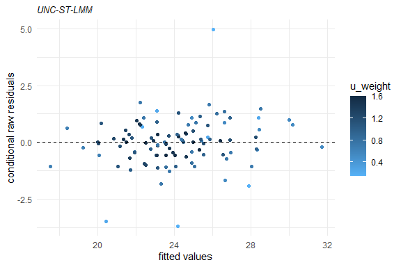
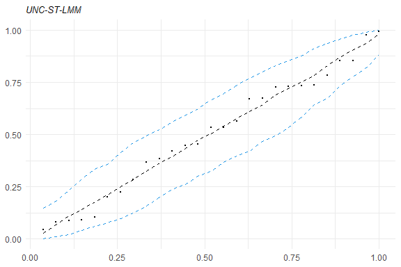

<!-- README.md is generated from README.Rmd. Please edit that file -->

# skewlmm

[](https://travis-ci.org/fernandalschumacher/skewlmm)
[](https://cran.r-project.org/package=skewlmm)

The goal of skewlmm is to fit skew robust linear mixed models, using
scale mixture of skew-normal linear mixed models with possible
within-subject dependence structure, using an EM-type algorithm. In
addition, some tools for model adequacy evaluation are available.

For more information about the model formulation and estimation, please
see Schumacher, F. L., Lachos, V. H., and Matos, L. A. (2021). Scale
mixture of skew‐normal linear mixed models with within‐subject serial
dependence. *Statistics in Medicine*. DOI:
[10.1002/sim.8870](https://doi.org/10.1002/sim.8870).

## Installation

<!-- You can install the released version of lmmsmsn from [CRAN](https://CRAN.R-project.org) with: -->

You can install skewlmm from GitHub with:

``` r
devtools::install_github("fernandalschumacher/skewlmm")
```

Or you can install the released version of skewlmm from
[CRAN](https://CRAN.R-project.org) with:

``` r
install.packages("skewlmm")
```

## Example

This is a basic example which shows you how to fit a SMSN-LMM:

``` r
library(skewlmm)
#> Loading required package: optimParallel
#> Loading required package: parallel
dat1 <- as.data.frame(nlme::Orthodont)
fm1 <- smsn.lmm(dat1, formFixed = distance ~ age, groupVar = "Subject",
                control = lmmControl(quiet=TRUE))
summary(fm1)
#> Linear mixed models with distribution sn and dependency structure UNC 
#> Call:
#> smsn.lmm(data = dat1, formFixed = distance ~ age, groupVar = "Subject", 
#>     control = lmmControl(quiet = TRUE))
#> 
#> Distribution sn
#> Random effects: 
#>   Formula: ~1
#> <environment: 0x0000000012ecfc70>
#>   Structure:  
#>   Estimated variance (D):
#>             (Intercept)
#> (Intercept)    6.505804
#> 
#> Fixed effects: distance ~ age
#> with approximate confidence intervals
#>                  Value  Std.error CI 95% lower CI 95% upper
#> (Intercept) 16.7624874 1.00640490   14.7899701   18.7350048
#> age          0.6601852 0.06985842    0.5232652    0.7971052
#> 
#> Dependency structure: UNC
#>   Estimate(s):
#>   sigma2 
#> 2.024342 
#> 
#> Skewness parameter estimate: 1.073796
#> 
#> Model selection criteria:
#>    logLik     AIC     BIC
#>  -221.657 453.314 466.724
#> 
#> Number of observations: 108 
#> Number of groups: 27
plot(fm1)
```



Several methods are available for SMSN and SMN objects, such as: print,
summary, plot, fitted, residuals, and predict.

Some tools for goodness-of-fit assessment are also available, for
example:

``` r
acf1<- acfresid(fm1, calcCI = TRUE)
plot(acf1)
```


``` r
plot(mahalDist(fm1),nlabels = 2)
```


``` r
healy.plot(fm1)
```



Furthermore, to fit a SMN-LMM one can use the following:

``` r
fm2 <- smn.lmm(dat1, formFixed = distance ~ age, groupVar = "Subject",
               control = lmmControl(quiet=TRUE))
summary(fm2)
#> $varRandom
#>             (Intercept)
#> (Intercept)    4.290319
#> 
#> $varFixed
#>   sigma2 
#> 2.025079 
#> 
#> $tableFixed
#>                  Value  Std.error CI 95% lower CI 95% upper
#> (Intercept) 16.7611111 0.99272253   14.8154107   18.7068115
#> age          0.6601852 0.06979482    0.5233898    0.7969805
#> 
#> $criteria
#>    logLik    AIC     BIC
#>  -221.695 451.39 462.118
#> 
#> $call
#> smn.lmm(data = dat1, formFixed = distance ~ age, groupVar = "Subject", 
#>     control = lmmControl(quiet = TRUE))
#> 
#> $distr
#> [1] "norm"
#> 
#> $formula
#> $formula$formFixed
#> distance ~ age
#> 
#> $formula$formRandom
#> ~1
#> <environment: 0x0000000018362258>
#> 
#> 
#> $D
#>             (Intercept)
#> (Intercept)    4.290319
#> 
#> $depStruct
#> [1] "UNC"
#> 
#> $estimates
#> $estimates$beta
#> [1] 16.7611111  0.6601852
#> 
#> $estimates$sigma2
#> [1] 2.025079
#> 
#> $estimates$dsqrt
#> [1] 2.071308
#> 
#> $estimates$D
#>          [,1]
#> [1,] 4.290319
#> 
#> 
#> $n
#> [1] 27
#> 
#> $N
#> [1] 108
#> 
#> $covParam
#>   sigma2 
#> 2.025079 
#> 
#> attr(,"class")
#> [1] "SMNsumm" "list"
```

Now, for performing a LRT for testing if the skewness parameter is 0,
one can use the following:

``` r
lr.test(fm1,fm2)
#> 
#> Model selection criteria:
#>       logLik     AIC     BIC
#> fm1 -221.657 453.314 466.724
#> fm2 -221.695 451.390 462.118
#> 
#>     Likelihood-ratio Test
#> 
#> chi-square statistics =  0.07597064 
#> df =  1 
#> p-value =  0.782834 
#> 
#> The null hypothesis that both models represent the 
#> data equally well is not rejected at level  0.05
```

For more examples, see help(smsn.lmm) and help(smn.lmm).
