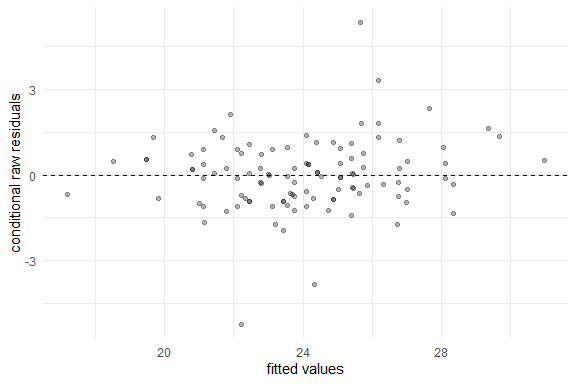
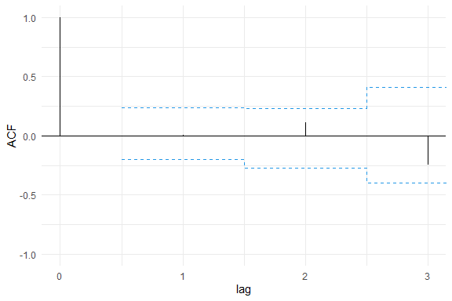
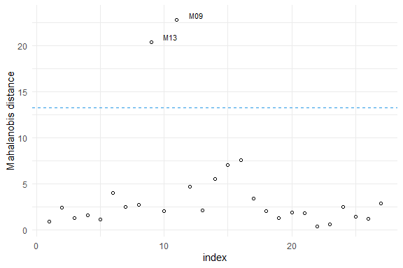

<!-- README.md is generated from README.Rmd. Please edit that file -->

# skewlmm

<!-- badges: start -->

<!-- badges: end -->

The goal of skewlmm is to fit skew robust linear mixed models, using
scale mixture of skew-normal linear mixed models with possible
within-subject dependence structure, using an EM-type algorithm. In
addition, some tools for model adequacy evaluation are available.

## Installation

<!-- You can install the released version of lmmsmsn from [CRAN](https://CRAN.R-project.org) with: -->

<!-- ``` r -->

<!-- install.packages("lmmsmsn") -->

<!-- ``` -->

You can install skewlmm from GitHub with:

``` r
library(devtools)
install_github("fernandalschumacher/skewlmm")
```

Or you can install the released version of skewlmm from
[CRAN](https://CRAN.R-project.org) with:

``` r
install.packages("skewlmm")
```

## Example

For more information about the model formulation and estimation, please
see  
Schumacher, F.L., Lachos, V.H., and Matos, L.A. (2020+) “Scale mixture
of skew-normal linear mixed models with within-subject serial
dependence”. Submitted. Preprint available at
<https://arxiv.org/abs/2002.01040>.

This is a basic example which shows you how to fit a SMSN-LMM:

``` r
library(skewlmm)
    dat1 <- as.data.frame(nlme::Orthodont)
    fm1 <- smsn.lmm(dat1,formFixed=distance ~ age,groupVar="Subject",quiet=T)
    summary(fm1)
#> Linear mixed models with distribution sn and dependency structure CI 
#> Call:
#> smsn.lmm(data = dat1, formFixed = distance ~ age, groupVar = "Subject", 
#>     quiet = T)
#> 
#> Distribution sn
#> Random effects: ~1
#> <environment: 0x0000000012502560>
#>   Estimated variance (D):
#>             (Intercept)
#> (Intercept)    6.599775
#> 
#> Fixed effects: distance ~ age
#> with approximate confidence intervals
#>                  Value  Std.error IC 95% lower IC 95% upper
#> (Intercept) 16.7629611 1.00673455    14.789798   18.7361245
#> age          0.6601852 0.06987075     0.523241    0.7971293
#> 
#> Dependency structure: CI
#>   Estimate(s):
#>  sigma2 
#> 2.02447 
#> 
#> Skewness parameter estimate: 1.10616
#> 
#> Model selection criteria:
#>    logLik     AIC     BIC
#>  -221.658 453.316 466.726
#> 
#> Number of observations: 108 
#> Number of groups: 27
    plot(fm1)
```



Several methods are available for SMSN and SMN objects, such as: print,
summary, plot, fitted, residuals, and predict.

Some tools for goodness-of-fit assessment are also available, for
example:

``` r
  acf1<- acfresid(fm1,calcCI=TRUE)
  plot(acf1)
```



``` r
  plot(mahalDist(fm1),fm1,nlabels=2)
```



``` r
  healy.plot(fm1)
```


Furthermore, to fit a SMN-LMM one can use the following:

``` r
    fm2 <- smn.lmm(dat1,formFixed=distance ~ age,groupVar="Subject",quiet=T)
    summary(fm2)
#> Linear mixed models with distribution norm and dependency structure CI 
#> Call:
#> smn.lmm(data = dat1, formFixed = distance ~ age, groupVar = "Subject", 
#>     quiet = T)
#> 
#> Distribution norm
#> Random effects: ~1
#> <environment: 0x000000001c19eb58>
#>   Estimated variance (D):
#>             (Intercept)
#> (Intercept)    4.289971
#> 
#> Fixed effects: distance ~ age
#> with approximate confidence intervals
#>                  Value Std.error IC 95% lower IC 95% upper
#> (Intercept) 16.7611111 0.9928306   14.8151990    18.707023
#> age          0.6601852 0.0698073    0.5233654     0.797005
#> 
#> Dependency structure: CI
#>   Estimate(s):
#>   sigma2 
#> 2.025442 
#> 
#> Model selection criteria:
#>    logLik    AIC     BIC
#>  -221.695 451.39 462.118
#> 
#> Number of observations: 108 
#> Number of groups: 27
```

Now, for performing a LRT for testing if the skewness parameter is 0,
one can use the following:

``` r
    lr.test(fm1,fm2)
#> 
#> Model selection criteria:
#>       logLik     AIC     BIC
#> fm1 -221.658 453.316 466.726
#> fm2 -221.695 451.390 462.118
#> 
#>     Likelihood-ratio Test
#> 
#> chi-square statistics =  0.07388406 
#> df =  1 
#> p-value =  0.7857633 
#> 
#> The null hypothesis that both models represent the 
#> data equally well is not rejected at level  0.05
```

For more examples, see help(smsn.lmm) and help(smn.lmm).
